# Printing the Positron LT parts
| [Download 3D Files](https://minhaskamal.github.io/DownGit/#/home?url=https://github.com/Fliens/Positron_LT/tree/main/Parts/Printed%20Parts&fileName=Printed_Parts) |
| --- |

>Note: These are suggestions, I designed the LT with these in mind but other settings might work aswell. The Design is based on an 0.4mm Nozzle

## Recommended Filaments:

>Note: We absolutely recommend using a technical material without any flexibility that can withstand high temperatures. Tested Filaments:

| Type | Brand | Name | Price | Link | Required Nozzle |
| --- | --- | --- | --- | --- | --- |
| PC Blend | Prusament | Carbon Fiber | 59.99€ | [link](https://www.prusa3d.com/product/prusament-pc-blend-carbon-fiber-black-800g-2/) | Hardened |
| GreenTEC | extrudr | Pro Carbon | 49.99€ | [link](https://amzn.to/3ZJIYcK) | Hardened |
| ASA | Prusament | Prusament ASA | 29.99€ | [link](https://www.prusa3d.com/category/prusament-asa/) | --- |

## Slicing:

| Layer height | Infill | Supports | Perimeters | Horizontal shells | 
| --- | --- | --- | --- | --- |
| 0.2mm | 40% | On build plate only | 5 (min) | Top: 9, Bot: 8 |

> Note: Some links might be affiliate links!

## Printing:
| Part Name | Orientation | Supports | Inserts |
| :---: | --- | --- | --- |
|[BASECOVER_LEFT_V01](./STL/BASECOVER_LEFT_V01.stl) |  |  Supports on build plate only  | |
|[BASECOVER_RIGHT_V01](./STL/BASECOVER_RIGHT_V01.stl) |  |  ---  | |
|[BASEPART_BACK_V01](./STL/BASEPART_BACK_V01.stl) | 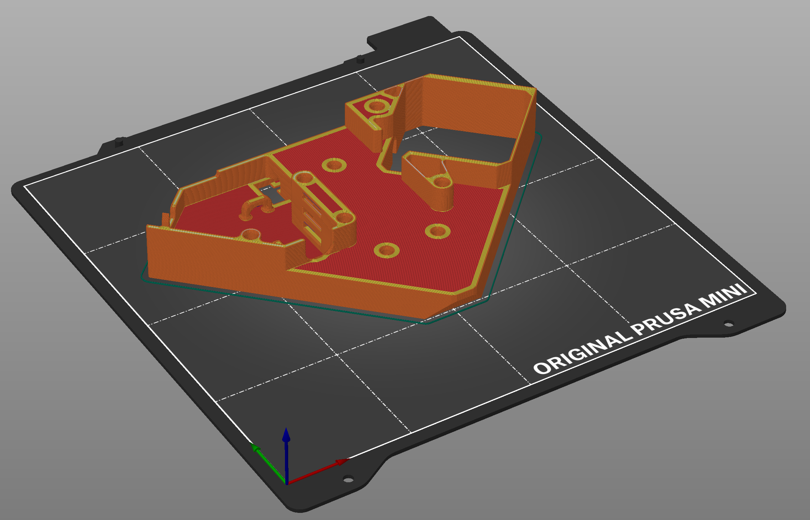 |  ---  | |
|[BASEPART_FRONT_V01](./STL/BASEPART_FRONT_V01.stl) | 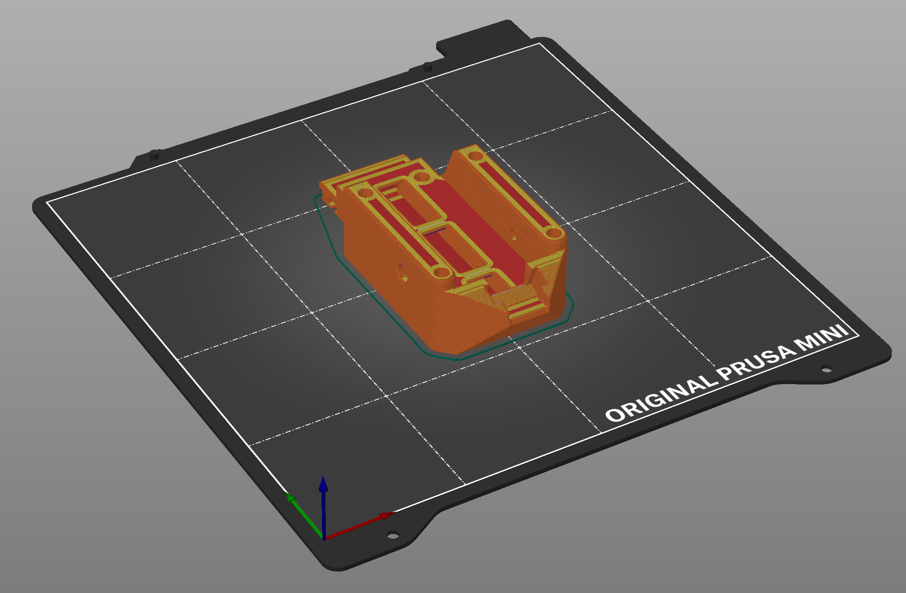 |  ---  | |
|[BASEPART_LEFT_V01](./STL/BASEPART_LEFT_V01.stl) | 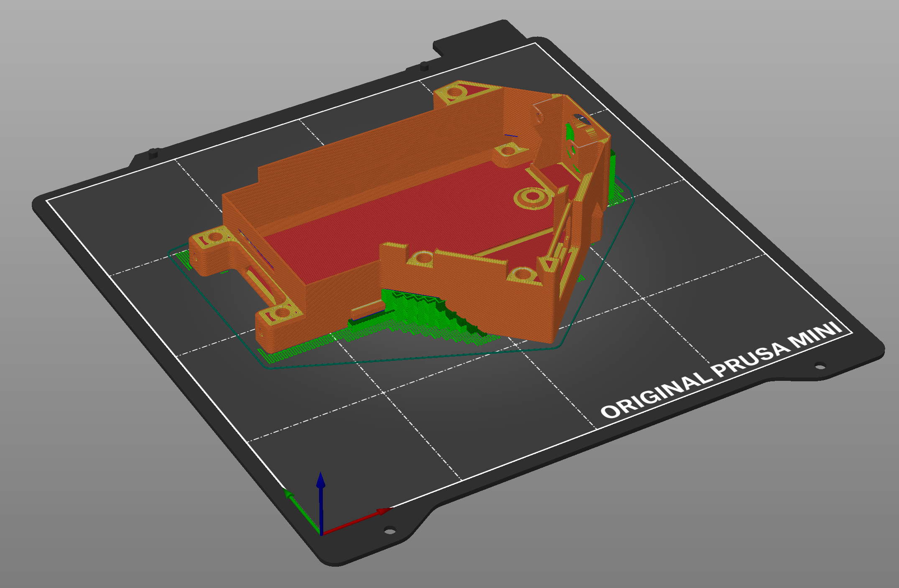 |  ---  | |
|[BASEPART_RIGHT_V01](./STL/BASEPART_RIGHT_V01.stl) |  |  ---  | |
|[BEDHOLDER_CONNECTOR_V01](./STL/BEDHOLDER_CONNECTOR_V01.stl) | 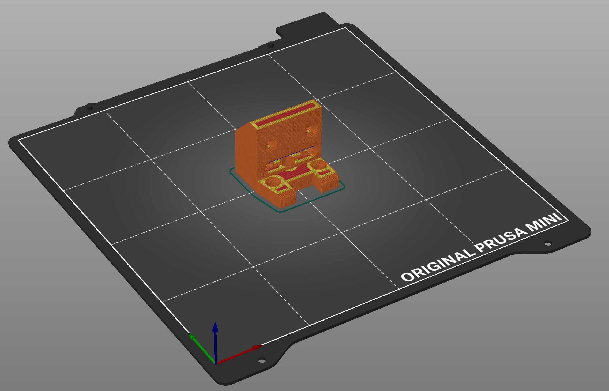 |  ---  | |
|[BED_HOLDER_MAIN_V01](./STL/BED_HOLDER_MAIN_V01.stl) | 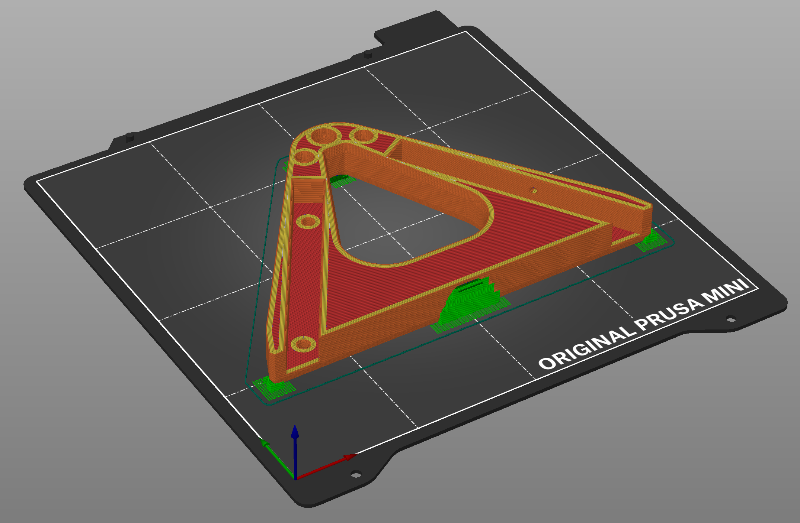 |  ---  | |
|[BELT-TENSIONER_Z_V01](./STL/BELT-TENSIONER_Z_V01.stl) |  |  ---  | |
|[BELT_CONNECTOR_V01_WIP](./STL/BELT_CONNECTOR_V01_WIP.stl) |  |  ---  | |
|[BELT_TENSIONER_XY_V01](./STL/BELT_TENSIONER_XY_V01.stl) |  |  ---  | |
|[BOTTON_COVER_V01](./STL/BOTTON_COVER_V01.stl) | 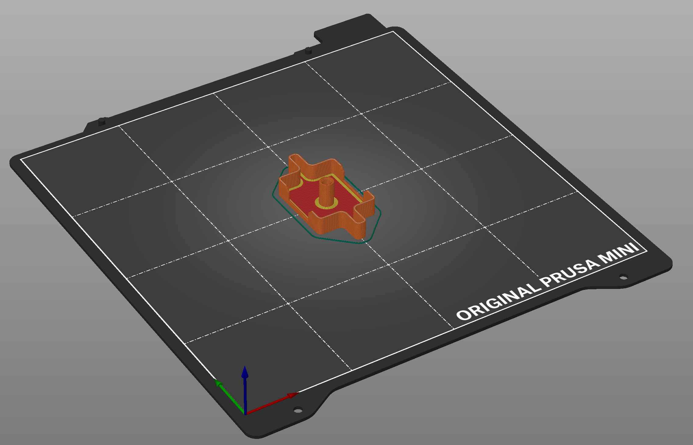 |  ---  | |
|[COVER_ROUND_V01](./STL/COVER_ROUND_V01.stl) |  |  ---  | |
|[DISTANCE_LEFT_V01](./STL/DISTANCE_LEFT_V01.stl) |  |  ---  | |
|[DISTANCE_RIGHT_V01](./STL/DISTANCE_RIGHT_V01.stl) | 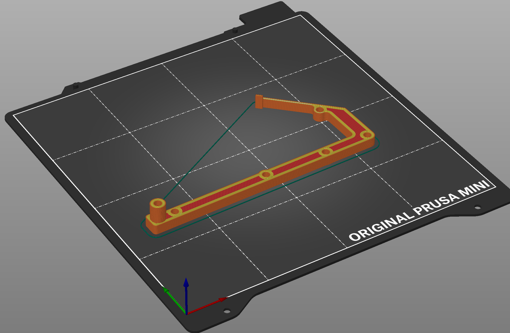 |  ---  | |
|[ENDCAP_BED-EXTRUSION_V01](./STL/ENDCAP_BED-EXTRUSION_V01.stl) | 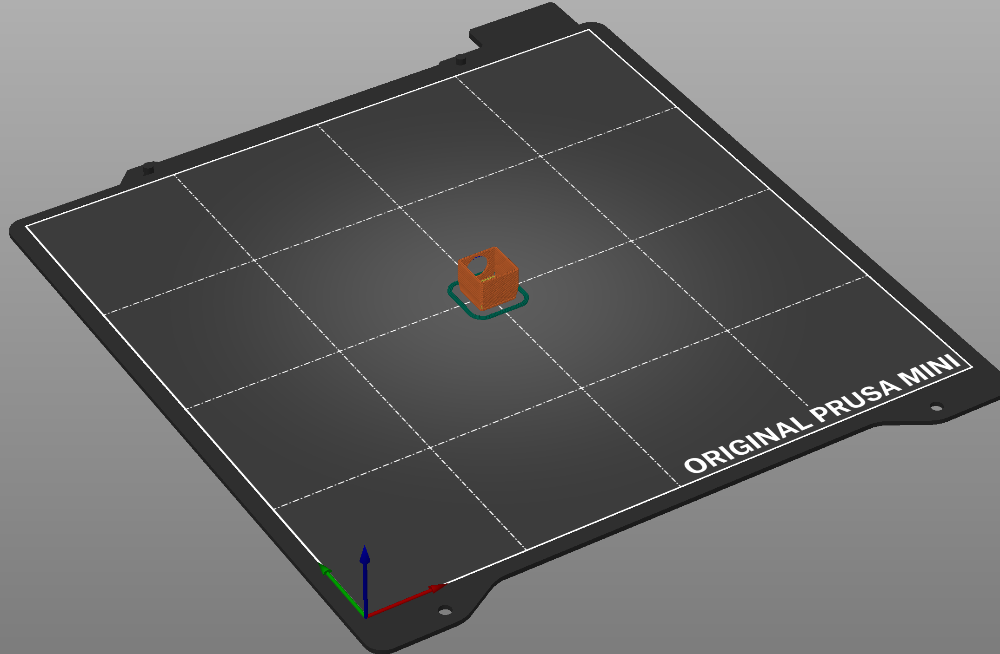 |  ---  | |
|[EXTRUDER_BASEPLATE_V01](./STL/EXTRUDER_BASEPLATE_V01.stl) |  |  ---  | |
|[INTERCONNECT_V02_WIP](./STL/INTERCONNECT_V02_WIP.stl) |  |  ---  | |
|[LEADSCREW_NUT_MOUNT_V01](./STL/LEADSCREW_NUT_MOUNT_V01.stl) | 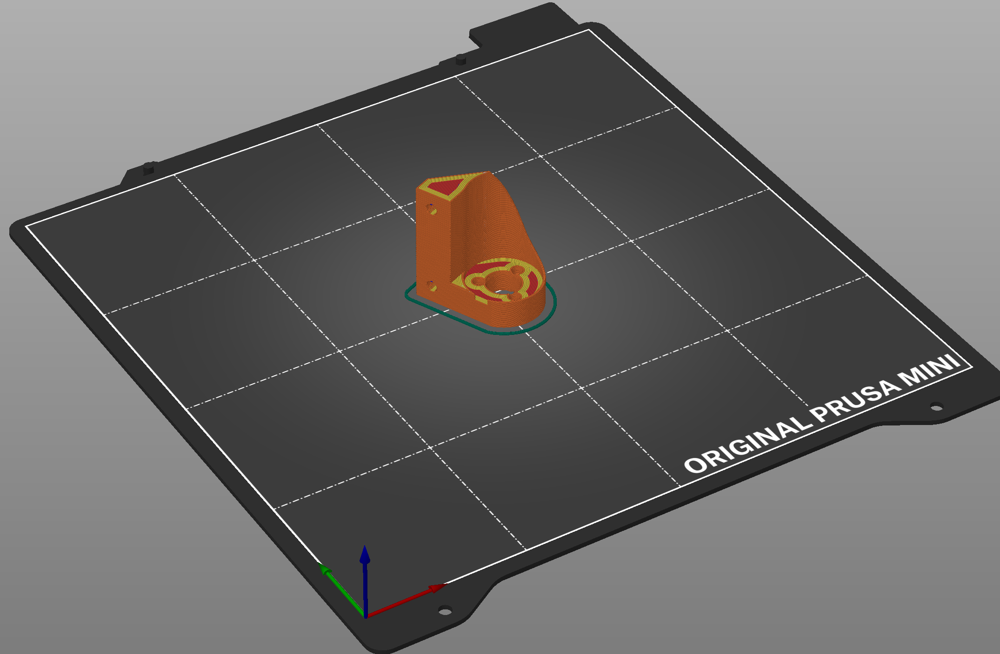 |  ---  | |
|[LED_INDICATOR_MOUNT_V01](./STL/LED_INDICATOR_MOUNT_V01.stl) |  |  ---  | |
|[MOTORBRACKET_LEFT_V01](./STL/MOTORBRACKET_LEFT_V01.stl) |  |  ---  | |
|[MOTORBRACKET_RIGHT_V01](./STL/MOTORBRACKET_RIGHT_V01.stl) | 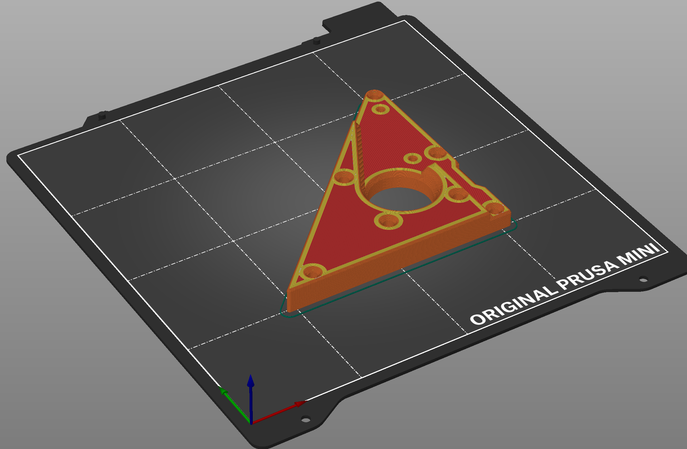 |  ---  | |
|[PICO_MOUNT_PRE-SKETCH_V01](./STL/PICO_MOUNT_PRE-SKETCH_V01.stl) |  |  ---  | |
|[SCREEN_BASE_V01_WIP](./STL/SCREEN_BASE_V01_WIP.stl) | 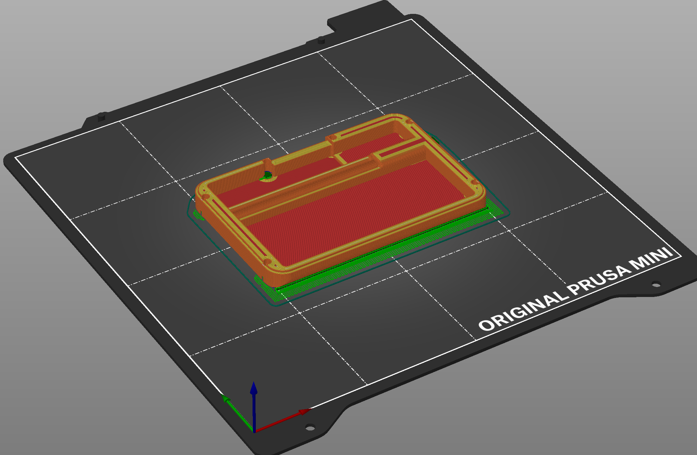 |  ---  | |
|[SCREEN_LID_V01_WIP](./STL/SCREEN_LID_V01_WIP.stl) |  |  ---  | |
|[SCREWMOUNT_BOTTOM_V01](./STL/SCREWMOUNT_BOTTOM_V01.stl) | 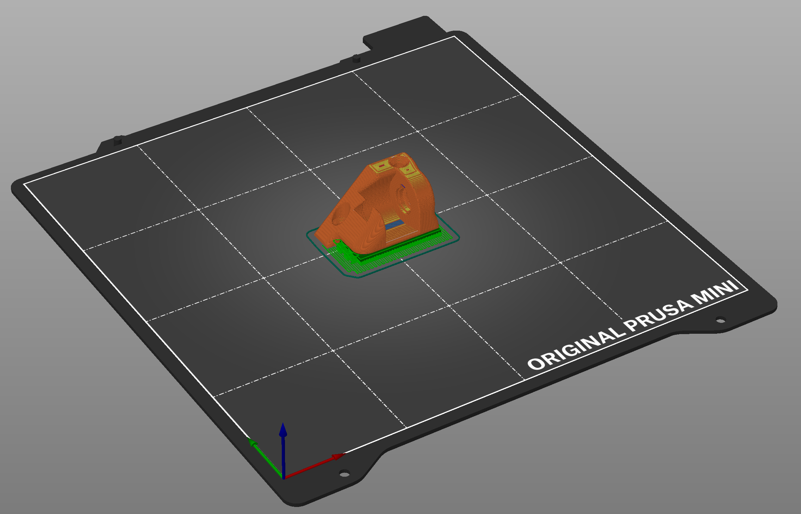 |  ---  | |
|[SIDE_PANEL_LEFT_V01](./STL/SIDE_PANEL_LEFT_V01.stl) |  |  ---  | |
|[SIDE_PANEL_RIGHT_V01](./STL/SIDE_PANEL_RIGHT_V01.stl) |  |  ---  | |
|[X-RAIL_ENDCAP_V01](./STL/X-RAIL_ENDCAP_V01.stl) |  |  ---  | |
|[XY-SPACER_V01](./STL/XY-SPACER_V01.stl) | 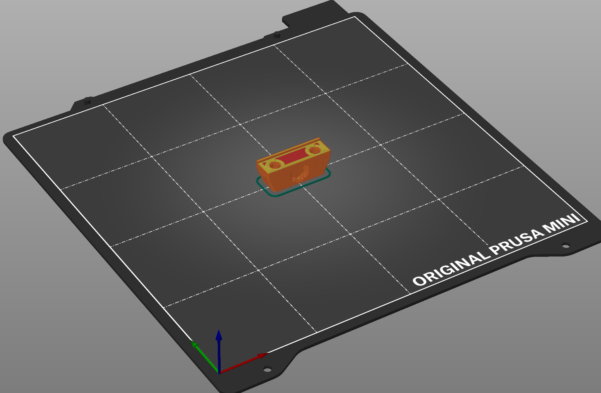 |  ---  | |
|[Z-AXIS-ENDSTOP_V01](./STL/Z-AXIS-ENDSTOP_V01.stl) |  |  ---  | |
|[Z-BLOCK_HOLDER_V01](./STL/Z-BLOCK_HOLDER_V01.stl) |  |  ---  | |

